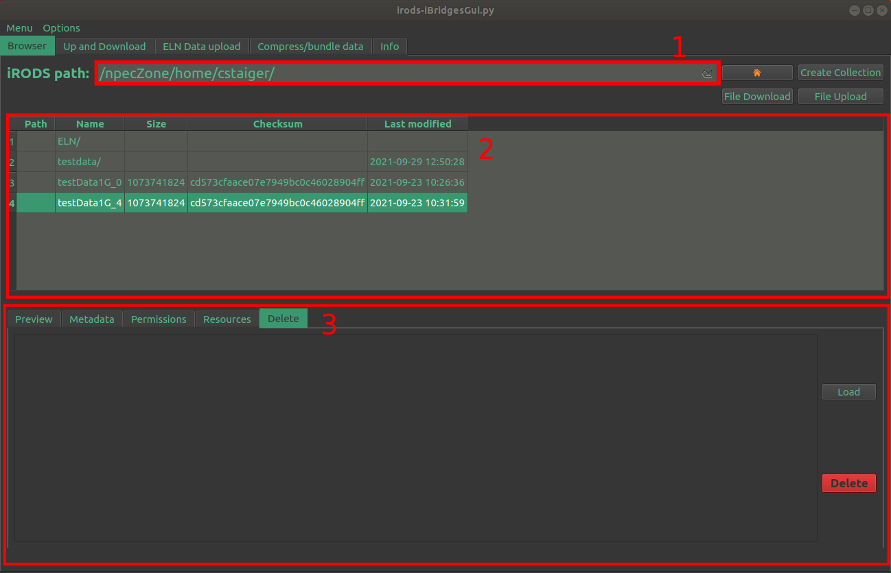
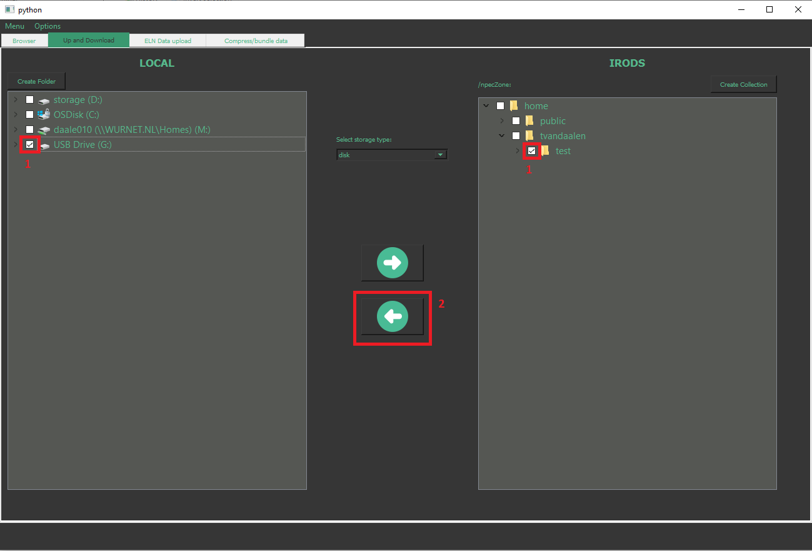
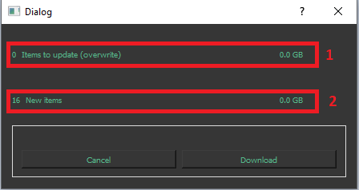
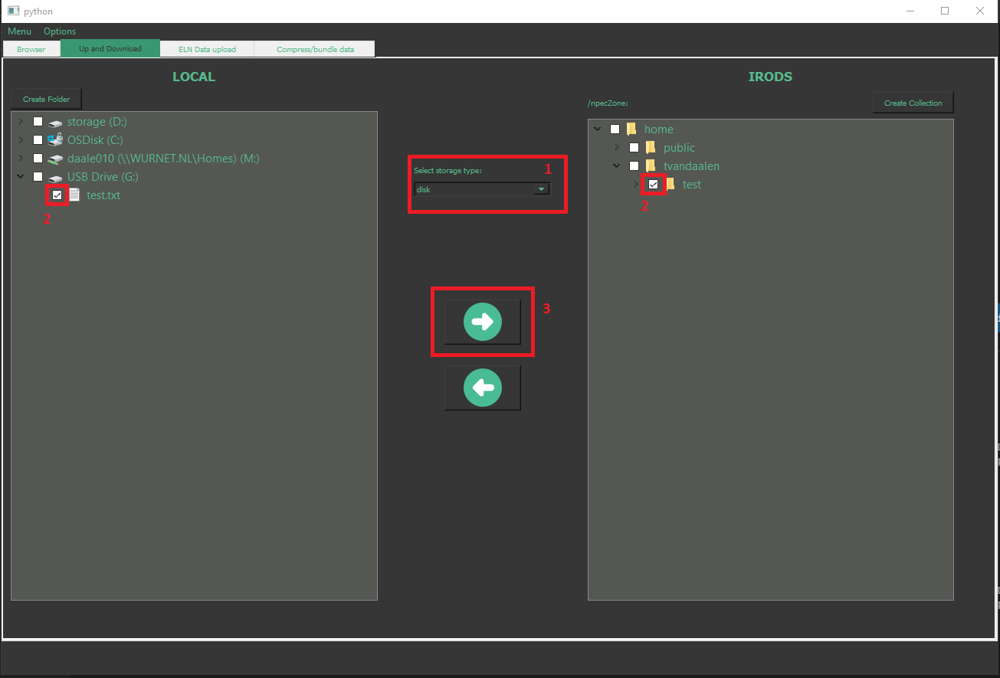
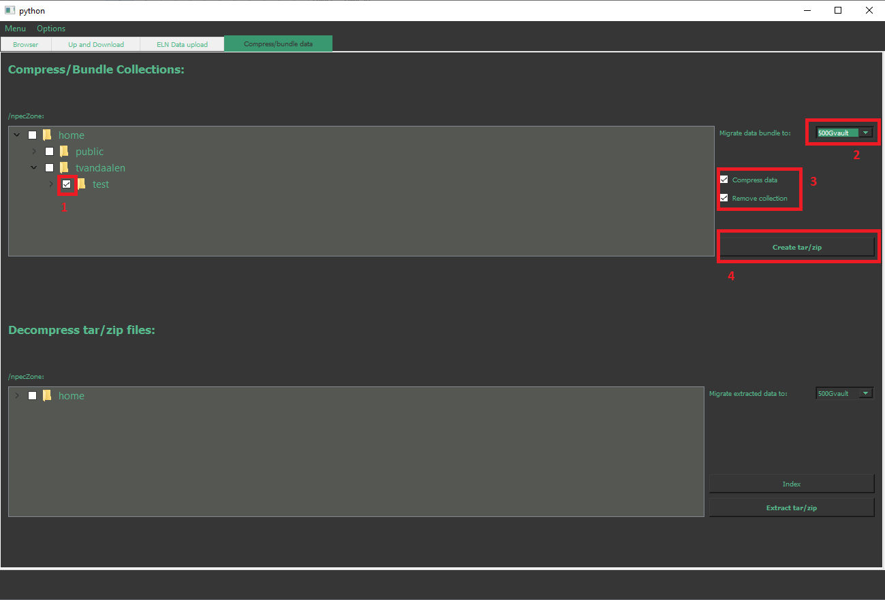
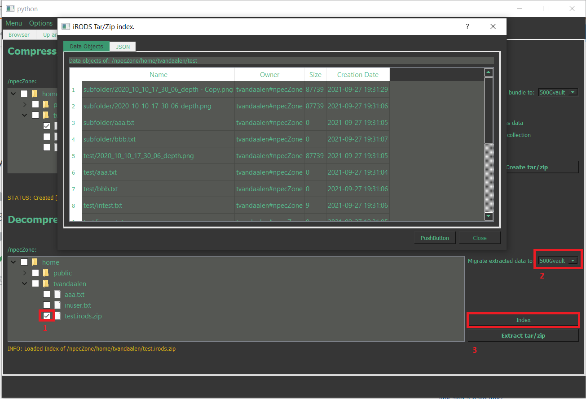

# iBridgesGui - How To?

The iBridgesGui is a GUI to an Data management platform based on iRODS. It exposes iRODS functionality through a GUI to the users. We divided the different function into groups where each function group is represented in an own tab in the GUI. The tabs are configured for the user depending on the user's rights and role in the Data management platform.
- The **Browser** is a tool to browse through iRODS collections and gather information on iRODS data objects
- The **Up and Download** tab gives tools to up and download large data safely.
- The **ELN Data upload** tab is made for specific data uploads that belong to an Experiment described in an ElabJournal instance. 
- In the **Compress/bundle data** tab the user is given tools to bundle (tar) or compress (zip) iRODS data collections and to extract them again.

## How to do simple data operations

To browse through your data collections in iRODS click on the **Browser** tab. 

1. Navigation bar: Type a valid collection or object path in and hit `enter`.
2. Collection and data object table: 
   - Click on the `Name`  of a collection or option. This will load the tabs below the table (see below)
   - Double click on a collection to navigate into the collection
3. Lower tabs
   - Preview: Lists the content of a collection or the first 50 lines  of textual data (.txt, .json, .csv)
   - Metadata: You can annotate collections and data objects with own annotation `key, value, unit`. The keys and values can be used in the search-drop down menu to look for data
   - Permissions: Will show the permissions own(er), read, write. If you have the role of data steward, you will also be able to change and add permissions
   - Resources: The tab shows on which storage resource data objects are stored. Note, collections do not have a resource.
   - Delete: In the browser table click on the collection or object you want to delete, then click `Load` and then `Delete`. This will delete a whole collection with all its members or the data object. 

Note: The `File Upload` and `File download` buttons are only meant for uploading and downloading small single files. For large data transfers click on the **Up and Download** tab.

### How to download data

 1. Select the iRODS collection or data object to download and the folder
    to download to. 
    
 2. Press the download button. A pop up window opens and the difference between the source and destination is calculated:
						- Based on checksums, a unique hash for each file the GUI determines whether the source file and the destination file are identical. If so, the file will **not** be downloaded again. The GUI will only download data which does not exist or differs.
	- The GUI also computes the total size of the data objects and will only start the download if the total amount will fit on your destination file system. 

When the  check is done the loading screen disappears and the number of files which exist with a different checksum (1) and files which only exist on iRODS (2) will be indicated. Press the `Download` button to start the file transfer. iRODS automatically checks the checksum to ensure all downloaded files are complete.

## How to upload data

 1. Check the resource. There may be several storage resources configured for you in the system. Your iRODS admin will give you advice which one to use for which data and workflow. Note, that `archive` resources are made to archive large files. Please adhere for those resources to the following policy:
	 - Files need to be 1GB or larger. 
	 - Do not start calculations on data which is stored on `archive` resources. They have a low latency and will inhibit your program. Your iRODS administrator can help you to migrate the data to a suited resources in that case. 
 2. Select the local file or folder and iRODS collection to upload to. 
  3. Press the upload button. As in the download, a pop up window will appear which will execute the same checks as for the data downloads.

## How to bundle data or compress data

You can bundle a collection that contains small files into one large tar file or even compress a collection into a zip file. Those files can then be safely put on the `archive` resources or, in case of zip, be used to reduce storage space.

1. Select the collection you want to compress
2. Select the storage resource on which the compressed or bundled data should be stored
3. Check `Compress data` to create a zip-file. If unchecked, a tar-file will be created
4. Check `Remove collection` if you just want to keep the tar or zip file.
5. The `Create tar/zip` compress the data into the file `<collection_name>.irods.tar`  or `<collection_name>.irods.zip`

Note, all you metadata will be preserved too and restored upon extraction.

## How to decompress data

Partial extract of data:

  1. Select the `*.irods.tar` or `*.irods.zip` file.
  2. Select the resource where the data should be extracted to.
  3. Use the `Index` button to get an overview of the files inside the tarred file. The `JSON` tab will  show the whole data package in JSON format including accession rights and metadata. Select the files you want to extract and click on `Extract Selected`. This schedules a job on the iRODS server  which will extract the data. Note, that this might take a while. `Close` the window and navigate to the browser to see whether the data is restored.

### How to search for data

Click on `Options` in the menu bar of the window and select `Search`. This will open a mask to search for  data objects and collections using metadata key-value pairs, collection paths and data object paths. 

The `Select and Close` button will load the selected collections and objects into the **Browser** tab where you can further inspect and annotate the data.

